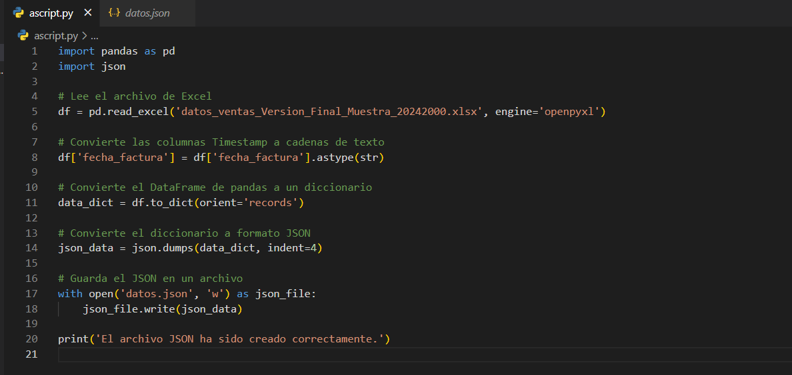
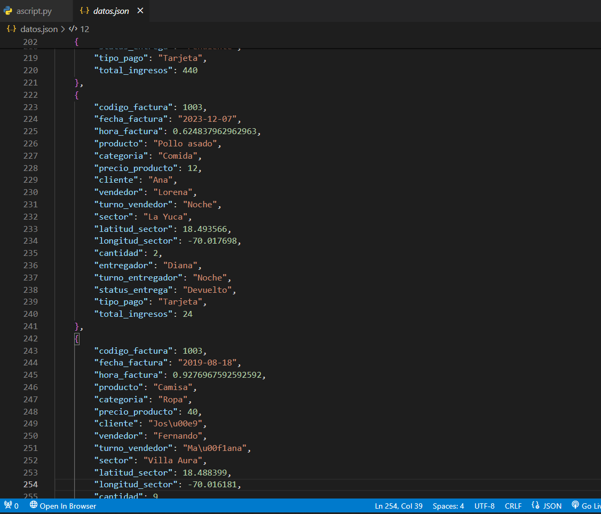

# 📊 Conversor de Archivo Excel a JSON 📋

Este proyecto proporciona un script en Python para convertir un archivo de Excel en un formato JSON. Es útil cuando necesitas transformar datos tabulares en un formato más flexible y fácilmente procesable.

## 🚀 Problema

Al trabajar con datos en un archivo de Excel, puede ser difícil procesarlos y manipularlos eficientemente. Además, a menudo necesitamos compartir estos datos en un formato más universal y fácilmente interpretable, como JSON.

## 💡 Propuesta

Este proyecto aborda este problema proporcionando un script simple en Python que toma un archivo de Excel como entrada y genera un archivo JSON con los datos contenidos en el archivo de Excel. Utiliza la biblioteca Pandas para cargar y manipular los datos del archivo de Excel, y luego convierte estos datos en un formato JSON utilizando la biblioteca estándar de Python `json`.

## 🔧 Solución

1. **Instalación de requisitos**: Asegúrate de tener Python instalado en tu sistema y ejecuta `pip install pandas` si no tienes la biblioteca Pandas instalada.

2. **Ejecución del script**: Ejecuta el script `convertir_excel_a_json.py`, asegurándote de proporcionar la ruta correcta al archivo de Excel que deseas convertir.

3. **Verificación del resultado**: El script generará un archivo JSON llamado `datos.json` que contendrá los datos del archivo de Excel en formato JSON.

## 📝 Premisa

Este script se desarrolló utilizando Python como lenguaje de programación principal. Hace uso de la biblioteca Pandas para manipular los datos del archivo de Excel y la biblioteca estándar de Python `json` para la conversión a formato JSON.

### Ejecución del Script



### Archivo JSON Resultante



## 📂 Repositorio

El código fuente de este proyecto está disponible en el siguiente repositorio: [Base_Datos_Json](https://github.com/JUANCITOPENA/Base_Datos_Json).

## 📄 Archivo JSON

El archivo JSON generado puede encontrarse [(https://raw.githubusercontent.com/JUANCITOPENA/Base_Datos_Json/main/datos.json)).
----
## 📝 Manual: Cómo Subir el Proyecto a GitHub

Para subir el proyecto a GitHub, sigue estos pasos:

1. **Crear un Repositorio en GitHub:**
   - Ve a [GitHub](https://github.com/) y haz clic en el botón "Nuevo" para crear un nuevo repositorio.
   - Asigna un nombre al repositorio y selecciona las opciones de visibilidad y licencia según tus preferencias.

2. **Clonar el Repositorio en tu Computadora:**
   - Copia el enlace del repositorio que acabas de crear.
   - Abre una terminal en tu computadora y ejecuta el siguiente comando, reemplazando `<enlace-repositorio>` con el enlace copiado:
     ```bash
     git clone https://github.com/JUANCITOPENA/Base_Datos_Json
     ```

3. **Copiar los Archivos del Proyecto:**
   - Copia el script Python (`script.py`) y el archivo JSON resultante (`datos.json`) al directorio recién clonado.

4. **Confirmar y Subir los Cambios:**
   - En la terminal, navega al directorio del repositorio clonado.
   - Ejecuta los siguientes comandos para confirmar y subir los cambios:
     ```bash
     git add script.py datos.json
     git commit -m "Añadir script.py y datos.json"
     git push origin main
     ```

5. **Verificar en GitHub:**
   - Ve a la página del repositorio en GitHub y verifica que los archivos `script.py` y `datos.json` se hayan cargado correctamente.

¡Listo! Has subido con éxito el proyecto y sus archivos a GitHub.

----

## 📝 Manual: Cómo Usar los Datos JSON en Excel desde la Web

Para usar los datos JSON en Excel desde la web, sigue estos pasos:

1. **Abrir Excel:**
   - Abre Microsoft Excel en tu computadora.

2. **Crear un Nuevo Libro:**
   - Crea un nuevo libro de Excel en blanco.

3. **Importar los Datos JSON:**
   - Ve a la pestaña "Datos" en la barra de herramientas de Excel.
   - Selecciona "Obtener datos" y luego "Desde otras fuentes".
   - Elije "Desde Web o el mismo JSON" y pega la URL del archivo JSON alojado en GitHub.
   - Sigue las instrucciones para importar los datos JSON a Excel.

4. **Trabajar con los Datos Importados:**
   - Una vez importados, podrás trabajar con los datos como lo harías con cualquier otro conjunto de datos en Excel.
   - -La idea es que ahora las personas que tengan acceso al archivo puedan realizar sus análisis y, cuando se suban nuevos cambios, simplemente deberán dar clic en 'Actualizar' para que los datos en sus archivos sean corregidos y actualizados automáticamente.
   - Puedes realizar análisis, generar gráficos, y más, dependiendo de tus necesidades.

5. **Actualizar los Datos:**
   - Si el archivo JSON en GitHub se actualiza, puedes actualizar los datos en Excel haciendo clic en "Actualizar" en la pestaña "Datos".

¡Listo! Ahora puedes acceder y trabajar con los datos JSON en Excel directamente desde la web.

----
## 📄 Licencia

Este proyecto está bajo la licencia MIT, que es una licencia de software libre que permite a los usuarios utilizar, modificar y distribuir el software sin restricciones. La única condición es que se incluya el aviso de copyright y la licencia en todas las copias o partes sustanciales del software.

Este proyecto está bajo la licencia MIT. Consulta el [sitio web de la Licencia MIT](https://opensource.org/licenses/MIT) para más detalles.

## 📋 Cómo usarlo

1. Clona el repositorio o descarga el archivo `convertir_excel_a_json.py`.
2. Ejecuta el script `convertir_excel_a_json.py` proporcionando la ruta al archivo de Excel que deseas convertir.
3. Verifica que se haya generado el archivo JSON `datos.json` con los datos convertidos.

